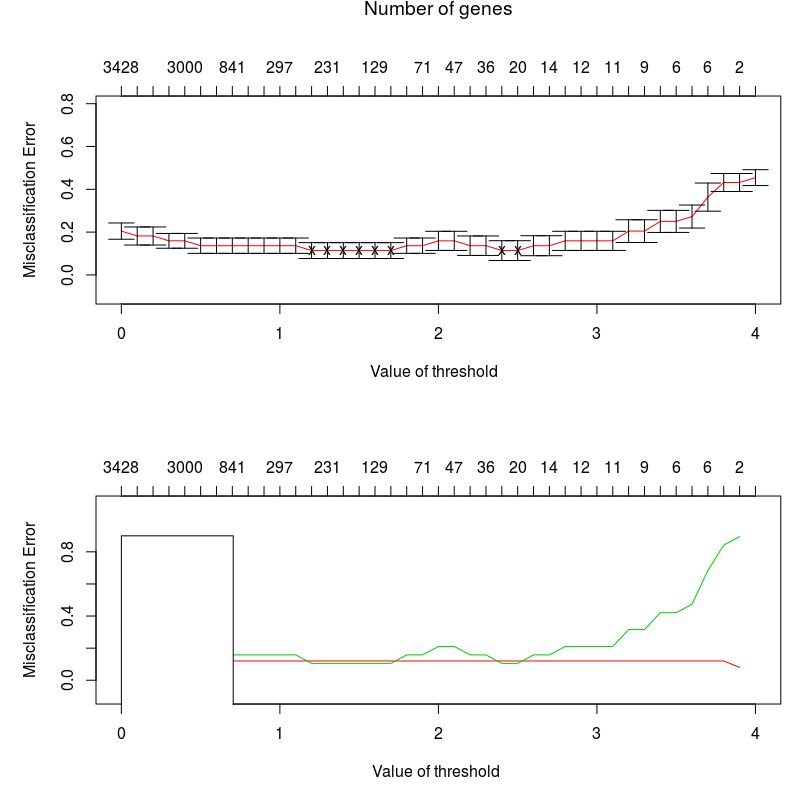

```{r setup, include=FALSE}
knitr::opts_chunk$set(echo = TRUE)
```


# Assignment 1

In this assignment, we will try to find explict model for Influenza data set. The data set has some features such as Influenza,Year,Week. We will try to predict Mortality by applying those features. To understand which feature has more effect on our target variable which is Mortality, we will mostly investigate features.

### Part 1

In the beginning, We applied scale function to examine the data. This is because Mortality and Influenza are not in same scale.

```{r message=FALSE,warning=FALSE}
library(readxl)
library(ggplot2)
library(mgcv)
library(pamr)

data <- as.data.frame(read_xlsx("Influenza.xlsx"))
scaled <- data.frame(scale(data))
scaled$Time <- data$Time
ggplot() + geom_line(data = scaled, aes(Time, Mortality), color="red") + 
  geom_line(data = scaled, aes(Time, Influenza), color="blue") +
   xlab("Time") + ylab("Scaled Mortality vs Influenza")

```

&nbsp;

In the graph, We see the weekly data results of mortality and influenza in Sweden between the years 1995 and 2004. It is observed that there is a correlation between the influenza and the rising mortality rates until 2000, but after 2000 we do not see such a clear correlation.

&nbsp;

### Part 2 and 3

Now when we look at the comparative chart for the predicted and observed data, we see that it catches the trend in general. But we can not say that it is successful for high values. We can come to the conclusion that we have a general pattern here. When we examine the summary, we can see that the spline function of the week gives more effect on the result and is the significant comparing to p-values. The variable year has very high p value which is not significant.

When we look at the graph of the spline component, we have proven that the supline function of the week is significant. The graph we obtained is quite similar to the graph of Mortality.

&nbsp;

```{r}
fit <- gam(Mortality ~ Year + s(Week,k=52),data=data,family = gaussian(),method = "GCV.Cp")
fittedMortality <- data
fittedMortality$Mortality <- fit$fitted.values
ggplot() + geom_line(data = fittedMortality, aes(Time, Mortality), color="blue") +
  geom_line(data = data, aes(Time, Mortality), color="red") +
   xlab("Time") + ylab("Mortality")

summary(fit)

# Plot the spline component
plot(fit)
```

### Part 4
```{r}
low_penalty <- gam(Mortality ~ Year + s(Week,k=52,sp=0.1),data=data,
                   family = gaussian(),method = "GCV.Cp")
fittedMortality <- data
fittedMortality$Mortality <- low_penalty$fitted.values
ggplot() + geom_line(data = fittedMortality, aes(Time, Mortality), color="blue") +
  geom_line(data = data, aes(Time, Mortality), color="red") +
   xlab("Time") + ylab("Mortality") + 
  ggtitle("Low Penalty - Predicted vs Observed Mortality")

high_penalty <- gam(Mortality ~ Year + s(Week,k=52,sp=100),data=data,
                    family = gaussian(),method = "GCV.Cp")
fittedMortality <- data
fittedMortality$Mortality <- high_penalty$fitted.values
ggplot() + geom_line(data = fittedMortality, aes(Time, Mortality), color="blue") +
  geom_line(data = data, aes(Time, Mortality), color="red") +
   xlab("Time") + ylab("Mortality")+ 
  ggtitle("High Penalty - Predicted vs Observed Mortality")

# Compare degrees of freedom
low_penalty
high_penalty
```

&nbsp;

We see that the low penalty value catches the trend better. As we increase the penalty value, we see that the ups and downs have sharpened. This causes the model to express the trend more generally.

#### What is the relationship of the penalty factor to the degrees of freedom?
When we look at the low and high penalty printed results, we can say that low penalty has higher degrees of freedom than high penalty. So high penalty has less freedom to move.

&nbsp;

### Part 5

When we compare the residuals (red) and the influenza (blue) values, we mostly see that residuals catches peak values and correlates.

&nbsp;

```{r}
fit <- gam(Mortality ~ Year + s(Week,k=52),data=data,
           family = gaussian(),method = "GCV.Cp")
customData <- data.frame(Time = data$Time, Residuals = fit$residuals)
ggplot() + geom_line(data = data, aes(Time, Influenza), color="blue") +
  geom_line(data = customData, aes(Time, Residuals), color="red") +
   xlab("Time") + ylab("Influenza")
```

&nbsp;

### Part 6

Here we include the Influenza into model and the rate of catching up trend of the model has increased considerably. The model captures both trend and  peak values. So the final model is better than previous ones.

By specifying k for spline component Influenza, we get less error result for prediction. Also, we plotted spline components.

&nbsp;

```{r}
kForYear <- length(unique(data$Year))
fit <- gam(Mortality ~ s(Year,k=kForYear) + s(Week,k=52) + s(Influenza,k=52),
           data=data,family = gaussian(),method = "GCV.Cp")
customData <- data.frame(Time = data$Time, FittedValues = fit$fitted.values)
ggplot() + geom_line(data = data, aes(Time, Mortality), color="blue") +
  geom_line(data = customData, aes(Time, FittedValues), color="red") +
   xlab("Time") + ylab("Mortality")

summary(fit)
# Plot the spline component
plot(fit)
```

When visually looking at the graph, it seems the new prediction model outperforms the old one in peaks of the
mortality rate and apart from the peaks, the two prediction models seem to follow a similar pattern.

# Assignment 2

### Part 1

```{r }
set.seed(12345)
data0=read.csv2("data.csv", sep = ";",fileEncoding = "latin1")
data=data0
confIndex <- which(colnames(data) == "Conference")
data$Conference=as.factor(data0$Conference)
n <- nrow(data)
rownames(data)=1:nrow(data)
index <- sample(1:n,size = floor(n*(7/10)))
train <- data[index,]
test <- data[-index,]

# Train X and Y
train_x=t(train[,-confIndex])
train_y=train[[confIndex]]

# Test X and Y
test_x=t(test[,-confIndex])
test_y=test[[confIndex]]

library(pamr)
mydata=list(x=train_x,y=train_y,geneid=as.character(1:nrow(train_x)), 
            genenames=rownames(train_x))
model_pamr=pamr.train(mydata,threshold = seq(0,4,0.1))
cvmodel_pamr=pamr.cv(model_pamr,mydata)
print(cvmodel_pamr)

# PLOT
pamr.plotcen(model_pamr, mydata, threshold=1)
pamr.plotcen(model_pamr, mydata, threshold=2.5)
a=pamr.listgenes(model_pamr,mydata,threshold=2.5)
cat( paste( colnames(data)[as.numeric(a[,1])], collapse='\n' ) )
cvmodel_pamr=pamr.cv(model_pamr,mydata)
print(cvmodel_pamr)

```

```{r}
# pamr.plotcv(cvmodel_pamr)
```



```{r}
minimumErrorIndex <- which.min(cvmodel_pamr$error)
bestThreshold <- cvmodel_pamr$threshold[minimumErrorIndex]
numberOfSelectedFeatures_pamr <- cvmodel_pamr$size[minimumErrorIndex]

tenMostFeatures <- pamr.listgenes(model_pamr, mydata, threshold = bestThreshold)[1:10,]
tenMostFeaturesIds <- as.numeric(tenMostFeatures[,1])
mostContributingFeatures <- colnames(data)[tenMostFeaturesIds]
```

```{r}
print(as.data.frame(mostContributingFeatures))
```


```{r}
pred_test <- pamr.predict(model_pamr,newx = test_x,threshold = bestThreshold,
                          type = "class")
# Function that builds the confusion matrix
confusion_matrix <- function(predicted, actual) {
    df <- data.frame("Pred" = predicted, "Real" = actual)
    confusion_mat <- with(df, table(Real, Pred))
    totals <- matrix(c(sum(confusion_mat[1, ]), sum(confusion_mat[2, ])), nrow = 2,
                     ncol = 1)
    confusion_mat <- cbind(confusion_mat, totals)
    colnames(confusion_mat) <- c("bad", "good", "Total")
    rownames(confusion_mat) <- c("bad", "good")
    return(confusion_mat)
}

cm <- confusion_matrix(pred_test,test_y)
error_rate_pamr <- (cm[1,2] + cm[2,1])/(cm[2,3] + cm[1,3])
print(error_rate_pamr)
```


### Part 2

We will try Elastic net and SVM algorithms to approach the problem from different ways.
We set the Elastic net algorithm with $\alpha=0.5$ and result as a binomial. Cross validation is also used to get best model.

&nbsp;

```{r message=FALSE,warning=FALSE}
library(glmnet)
cvmodel_glmnet <- cv.glmnet(x = as.matrix(train[,-confIndex]),y = train_y,
                            family = "binomial",alpha = 0.5)
minLambdaIndex <- which(cvmodel_glmnet$lambda ==cvmodel_glmnet$lambda.min)
numberOfSelectedFeatures_glmnet <- cvmodel_glmnet$nzero[minLambdaIndex]
pred_test <- predict(cvmodel_glmnet,newx = as.matrix(test[,-confIndex]),
                     s = "lambda.min",type = "class")

cm <- confusion_matrix(as.factor(pred_test),test_y)
error_rate_glmnet <- (cm[1,2] + cm[2,1])/(cm[2,3] + cm[1,3])
```

&nbsp;

We also use the SVM algorithm with vanilladot kernels.

&nbsp;

```{r message=FALSE,warning=FALSE}
library(kernlab)
model_kernlab <- ksvm(as.factor(Conference) ~ .,data = train,kernel = "vanilladot",scale=FALSE)
pred <- predict(model_kernlab, test, type = "response")

cm <- confusion_matrix(pred,test_y)
error_rate_kernlab <- (cm[1,2] + cm[2,1])/(cm[2,3] + cm[1,3])
```

&nbsp;

We calculated the error rates for all the algorithms we used. In this step we will be able to evaluate the results with a comparative table. When we look at the graph, we see that the result of Nearest Shrinken Centroid and Elastic net is at the same rate But the SVM algorithm seems to have an error rate less than 0.05 comparing to others. In this case, we can use SVM algorithm for this problem. 

&nbsp;

```{r message=FALSE,warning=FALSE}
df <- data.frame(NSC = error_rate_pamr, 
                 Elasticnet = error_rate_glmnet, 
                 SVM = error_rate_kernlab)
rownames(df) <- "Error Rate"

library(pander)
pander(df, type = 'grid')
```


### Part 3

To investigate Benjamini–Hochberg method, we need to implement some steps. First we need to put all p-values in order. After that we assign ranks for each p-value. Thus, we are ready to calculate Benjamini-Hochberg method. We divide each rank by total number of tests. Finally we multiply the result by alpha value which is $\alpha = 0.05$

Benjamini–Hochberg method allows us to evaluate p-value by approaching it from another way. Thus, we can avoid type 1 errors, rejecting the true null hypothesis.

```{r message=FALSE,warning=FALSE}


p_value <- data.frame(iteration = numeric(), p_value = numeric())
maxIteration <- ncol(data)-1
for(i in 1:maxIteration){
    p <-  t.test(data[,i] ~ data$Conference)$p.value
    p_value <- rbind(p_value,data.frame(i,p))
}

library(tidyverse)
p_value <- p_value %>%
    mutate(feature = colnames(data[1:4702])) %>%
    arrange(p) %>%
    mutate(rank = seq_along(.$i),
           BH = (rank/4702)*0.05,
           bh_sign = BH > p)

table(p_value$bh_sign)

```

According to result, we have 39 variables which are considered as significant by the Benjamini-Hochberg method. 

```{r}
 ggplot(data = p_value) +
     geom_point(aes(x = rank, y = p, color = bh_sign)) +
     geom_vline(xintercept = 39) +
     labs(title = "Benjamini-Hochberg Significance", x = "Variables ordered by p-value", y = "p-value")
```

# Appendix

```{r, ref.label=knitr::all_labels(),echo=TRUE,eval=FALSE}
```


