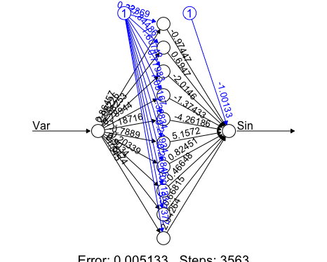

# Assignment 1
In this assignment, we will implement kernel method to predict hourly temperatures for a date and place in Sweden. For that purpose, We have datasets such as stations.csv and temps50k.csv. They have information about weather stations and temperatures.

### Part 1

Here, we imported data and merged them to have one data frame. Then, we preprocessed tha data like hours,minutes, dates. We defined points and date for prediction.

```{r}
set.seed(1234567890)
library(geosphere)
library(ggplot2)

stations <- read.csv("stations.csv", fileEncoding = "ISO-8859-1")

temps <- read.csv("temps50k.csv")
temps$date <- as.Date(temps$date)
temps$time <- as.character(temps$time)

hour <- c()
minutes <- c()
for(i in 1:nrow(temps)){
    tmp <- strsplit(temps$time[i], split = ":")
    hour[i] <- as.numeric(tmp[[1]])[1] * 60
    minutes[i] <- as.numeric(tmp[[1]])[2] + hour[i]
}
temps$minutes <- minutes

st <- merge(stations,temps,by="station_number")

# Point to predict
coords <- c(59.20078,  18.01467)

# Date to predict
date_pred <- as.Date("1994-07-27")
st <- subset(x = st, st$date < date_pred)

# These three values are up to the students
h_distance <- 10000
h_date <- 2
h_time <- 3*60

```

We will use kernel gaussian to calculate distance, date and time differences. We seperately calculate them and apply kernel_gaussian() function. Then we store each result.

```{r}
kernel_gaussian <- function(dist, h){
    kernel <- exp(-abs(dist)/(2 * h))
    return(kernel)
}

# Distance
dist_meter <- distHaversine(p1 = c(coords[1], coords[2]),
                            p2 = matrix(c(st$latitude, st$longitude), ncol = 2))
kernel_meter <- kernel_gaussian(dist_meter, h_distance)
plot(dist_meter, kernel_meter)

# Date
dist_date <- as.numeric(date_pred - st$date)
kernel_date <- kernel_gaussian(dist_date, h_date)
plot(dist_date, kernel_date)

# Time
times <- seq(4, 24, 2) * 60
dist_time <- sapply(times, function(x){x - st$minutes})
kernel_time <- kernel_gaussian(dist_time, h_time)
plot(dist_time, kernel_time)
```

Hence, we use kernel results in iteration between hours. We calculate kernel sum and kernel product. Thus, we have predictions for each 2 hours.

```{r}
# Prediction
temp_sum <- vector(length=length(times))
temp_prod <- vector(length=length(times))
for(i in 1:length(times)){
    # Kernel sum
    kernel_sum <- (kernel_meter + kernel_date + kernel_time[,i])
    temp_sum[i] <- sum(kernel_sum * st$air_temperature) / sum(kernel_sum)
    
    # Kernel prod
    kernel_prod <- (kernel_meter * kernel_date * kernel_time[,i])
    temp_prod[i] <- sum(kernel_prod * st$air_temperature) / sum(kernel_prod)
}
temp_sum
temp_prod

# Plots
qplot(x = times, y = temp_sum, geom = "line")
qplot(x = times, y = temp_prod, geom = "line")
```


As a result of the implementation, we have two plots which shows kernel sums and product results. The summation of kernels get highly affected by the temperatures of the parts of Sweden that are actually far away from the area of forecast, but close in the respect of time and/or date. When kernels are multiplied, the low kernels have higher influence on the final product. So the observation from an area that is far away in distance but close in time and date will have lower final weight in multiplication case than in the case of suming the kernels. Hence, the multiplication of the kernels is a better way of forecasting the temperatures.

# Assignment 2

### Part 1

In this assignment, we will train a neural network to learn the trigonometric sine function. To achieve this, we created a data which has random 50 points sample as uniformly distributed. We split the data 50% 50% as trainin and validation sets. We also defined initial weights to be used in neural network. 
In every iteration, we calculated mean squared error to make comparison at the end. After iteration, we found the index as 4 which represents minimum MSE. Hence, we use $4/1000 = 0.004$ as final threshold value.

&nbsp;

```{r}
library(neuralnet)
set.seed(1234567890)
Var <- runif(50, 0, 10)
trva <- data.frame(Var, Sin=sin(Var))
tr <- trva[1:25,] # Training
va <- trva[26:50,] # Validation
# Random initialization of the weights in the interval [-1, 1]
winit <- runif(31, -1, 1)
MSE <- rep(0, 10)
for(i in 1:10) {
  nn <- neuralnet(Sin~Var,data = tr, hidden=10, threshold = i/1000, startweights = winit )
  pred <- compute(nn,va[,"Var"])$net.result
  MSE[i] <- sum((va$Sin - pred)^2) / 25
}
minIndex <- which.min(MSE)
nn <- neuralnet(Sin~Var,data = tr, hidden=10, threshold = minIndex/1000, startweights = winit )
# plot(nn)
# # Plot of the predictions (black dots) and the data (red dots)
# plot(prediction(nn)$rep1)
# points(trva, col = "red")
```

&nbsp;

When we look at the plot, we can say that our neural network learned the trigonemetric sine function properly. To prove this statement, we can look at the MSE rate. As seen below, MSE rate is very low.

$$MSE[minIndex]=0.0003400357697$$


